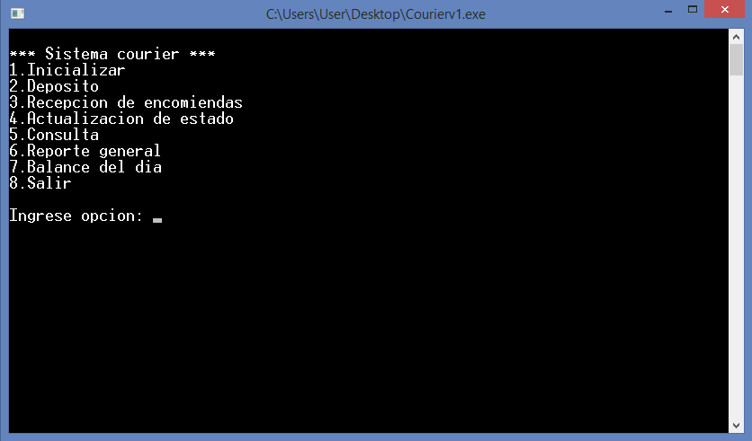
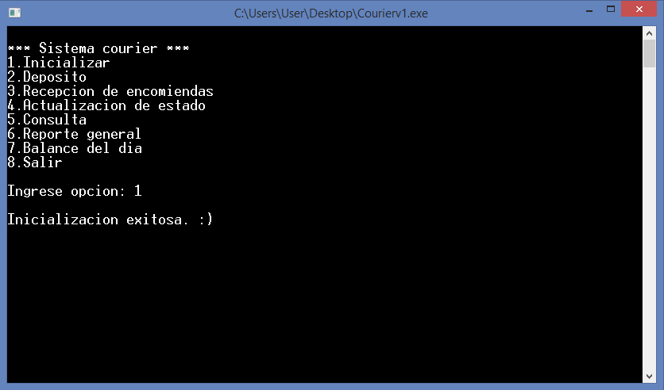
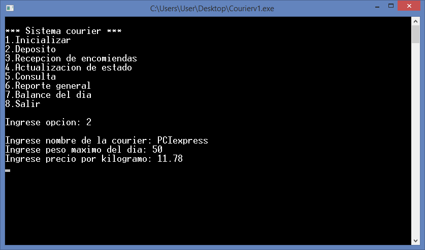
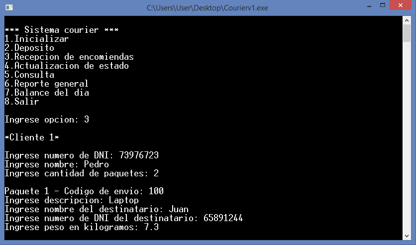
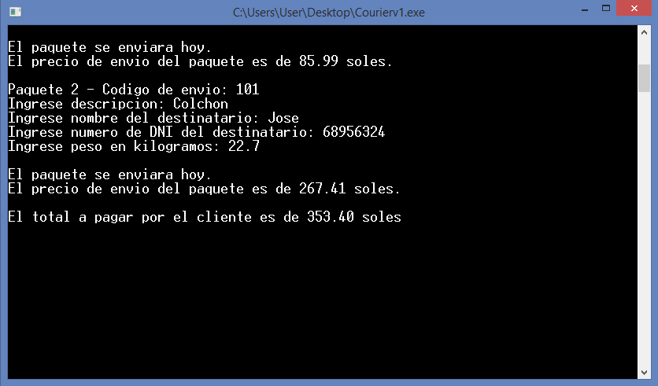
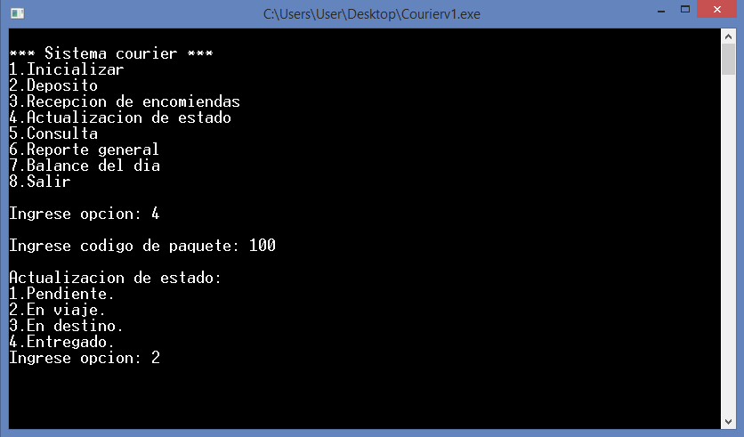
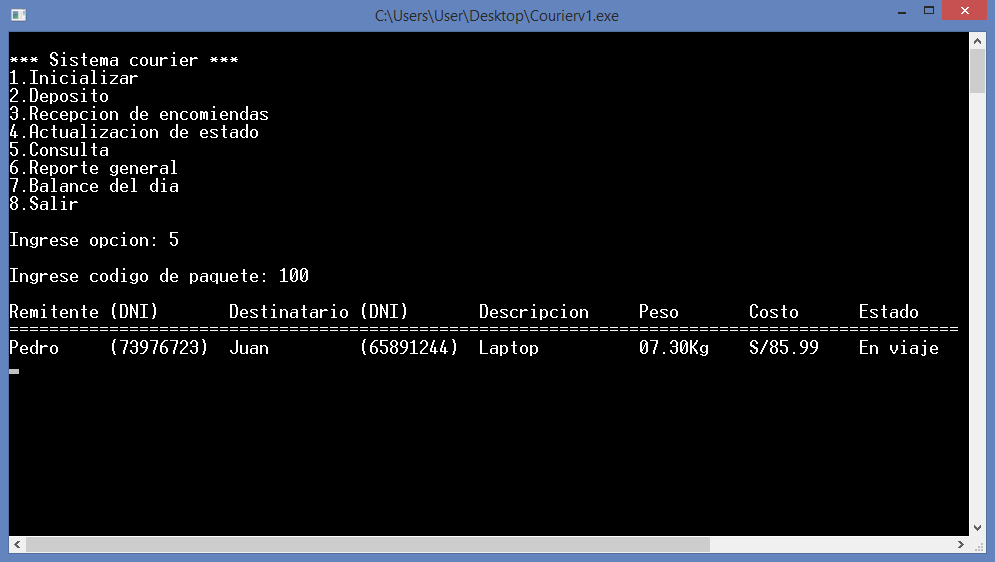
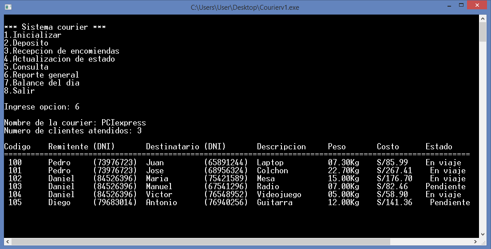
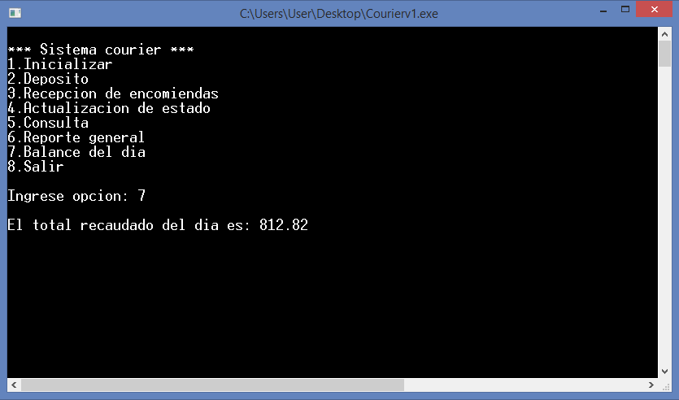
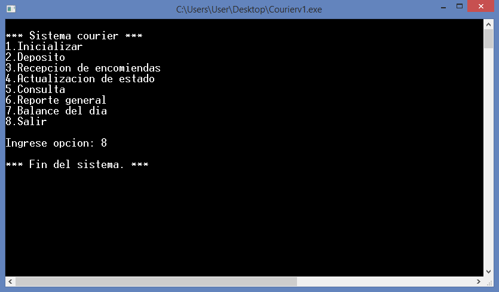

# Sistema Courier - C
Sistema de una Courier en lenguaje C. Proyecto del **segundo semestre** de estudios en Ingeniería Informática, presentado el **24/07/18**.

## Descripción
Crea una Courier con el máximo de encomiendas y el precio por kilogramo para luego registra las encomiendas y actualiza su estado de envió, este estado puede ser consultado en el sistema, así como el dinero recaudado del día.
<div align="center">

<p><strong>Imagen:</strong> Menú principal.</p>
</div>

## Uso
1. **Inicializar**: Se inicializa la courier y sus variables.

<div align="center">

<p><strong>Imagen:</strong> Opción inicializar.</p>
</div>

2. **Depósito**: Se ingresa el nombre del Courier, el peso máximo de encomiendas diarias y el precio por kilogramo.
<div align="center">

<p><strong>Imagen:</strong> Opción déposito.</p>
</div>

3. **Recepción de encomiendas**: Se ingresan los datos del cliente (DNI y nombre), la cantidad de paquetes que enviará el cliente, los datos de cada paquete (Descripción, destinatario, DNI del destinatario y peso) y se muestra el precio por paquete, total a pagar y si cada envío saldrá en el día actual o al día siguiente. Para cada paquete recibido se genera un código de envío de 3 dígitos. En esta opción el estado de todo paquete queda como pendiente.
<div align="center">

<p><strong>Imagen:</strong> Opción recepción de encomiendas paquete 1.</p>
</div>
<div align="center">

<p><strong>Imagen:</strong> Opción recepción de encomiendas paquete 2.</p>
</div>

4. **Actualización de estado**: Se ingresa el código de envío de un paquete para modificar su estado entre 4 opciones disponibles (Pendiente, en viaje, en destino y entregado).
<div align="center">

<p><strong>Imagen:</strong> Opción actualizarción de estado paquete 1.</p>
</div>

5. **Consulta**: Se ingresa el código de envío de un paquete para mostrar sus detalles (Remitente, DNI del remitente, destinatario, DNI del destinatario, descripción, peso, costo y estado).
<div align="center">

<p><strong>Imagen:</strong> Opción consulta paquete 1.</p>
</div>

6. **Reporte general**: Aquí se muestra el nombre del Courier, el número de clientes atendidos y una lista detallada de todos los envíos.
<div align="center">

<p><strong>Imagen:</strong> Opción reporte general.</p>
</div>

7. **Balance del día**: Aquí se muestra el total de dinero recaudado.
<div align="center">

<p><strong>Imagen:</strong> Opción balance del día.</p>
</div>

8. **Salir**: Finaliza la ejecución del programa.
<div align="center">

<p><strong>Imagen:</strong> Opción salir.</p>
</div>

### Nota
- Después de entrar a una opción y haber terminado con la ejecución es necesario volver a teclear ```enter``` para regresar al menú principal.
- En la opción **Consulta** se ingresa el código del producto, dicho código se asigna automáticamente desde el número 100 en adelante.

## Autores
- Ramirez Benites Rafael
- [Rojas Vera Aarón](https://github.com/Aaron-Shrike)
